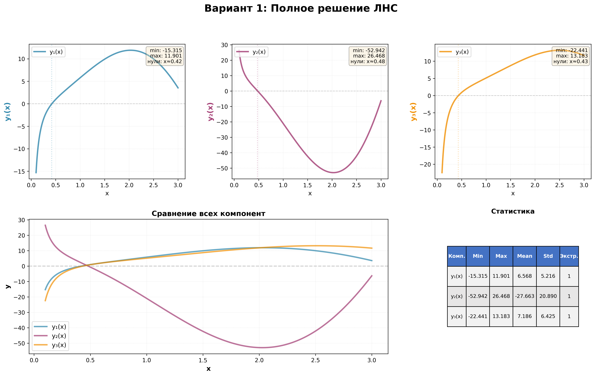
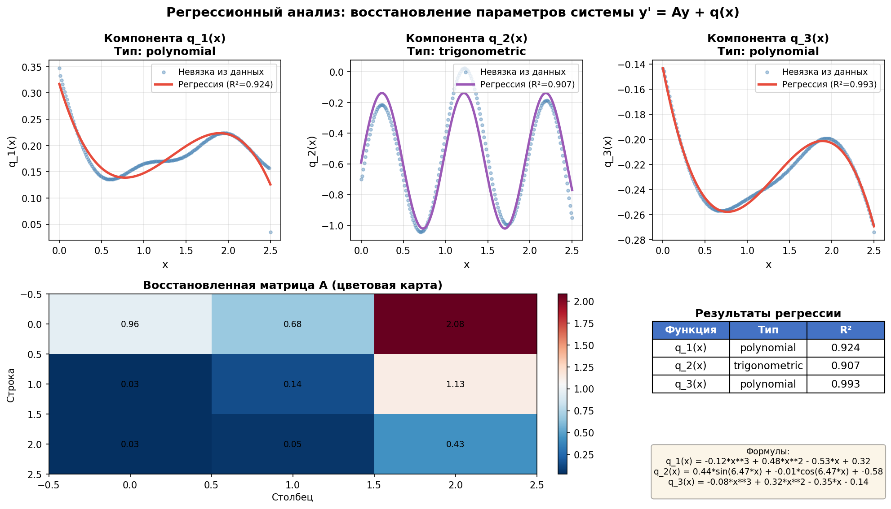

# Решение ЛНС (линейных неоднородных систем)

Решение дифференциальных уравнений вида **y' = Ay + q(x)** методом вариации постоянных.

> **Поддерживаемые типы q(x):** полиномы, экспоненты, тригонометрические неоднородности, резонанс, особые точки и их комбинации. Для других типов неоднородностей потребуется расширение программы.
> 
> **Ограничения:** Матрицы размером 2×2 или 3×3.

## Зависимости

```bash
pip install -r requirements.txt
```

## Запуск

```bash
python main.py              # Готовый пример 1
python main.py 2            # Готовый пример 2
python main.py --custom     # Своя система
python main.py --regression # Регрессия: найти параметры из данных
```

## Визуализация

Программа автоматически создаёт подробную аналитическую визуализацию решений:



Для каждого решения сохраняются 3 файла:
- **PNG** - график
- **CSV** - численные данные для анализа
- **TXT** - подробный текстовый отчёт

---

## Регрессия (обратная задача)

По экспериментальным данным y(x) восстанавлиются матрица A и неоднородности q(x).

> **Примечание:** Регрессионный модуль автоматически определяет тип неоднородностей среди 3 базовых классов: полиномы, экспоненты, тригонометрия.

### Запуск

**Демонстрация:**
```bash
python main.py --regression
# Выберите [1] - Демонстрация
```

**Свои данные из CSV:**
```bash
python main.py --regression
# Выберите [2] - Загрузить из CSV
```

Пример CSV файла в `data/example_data.csv`

### Результат



**Верхний ряд (3 графика)** — Восстановленные неоднородности q₁(x), q₂(x), q₃(x):
- Точки (голубые) — данные, извлеченные из невязки y' - Ay
- Линия (красная/зеленая/фиолетовая) — найденная аналитическая формула
- Цвет показывает тип: красный = полином, зеленый = экспонента, фиолетовый = тригонометрия
- R² — коэффициент детерминации (близость к 1.0 означает хорошую точность)

**Нижний ряд слева** — Восстановленная матрица A (система y' = Ay + q(x)):
- **Строки**: производные y'₁, y'₂, y'₃
- **Столбцы**: переменные y₁, y₂, y₃
- **A[i,j]** показывает влияние yⱼ на производную y'ᵢ
- Например, A[0,0] = 0.96 означает: если y₁ увеличится на 1, то y'₁ увеличится на 0.96
- Цветовая карта: красный = положительное влияние, синий = отрицательное

**Нижний ряд справа** — Таблица с типами неоднородностей (polynomial/trigonometric/exponential) и точностью R²

### Алгоритм

1. Вычисляет производную y'(x) численно
2. Восстанавливает A через Ridge-регрессию
3. Находит q(x) из невязки y' - Ay
4. Подбирает формулу: полином / экспонента / тригонометрия
5. Уточняет A с учётом найденного q(x)

---

## Математика

Метод вариации постоянных для **y' = Ay + q(x)**:

1. Фундаментальная матрица **Φ(x)**: Φ'(x) = A·Φ(x)
2. **c'(x) = Φ⁻¹(x)·q(x)**, **c(x) = ∫c'(x)dx**
3. Частное решение **ψ(x) = Φ(x)·c(x)**
4. Общее решение **y(x) = Φ(x)·c + ψ(x)**
