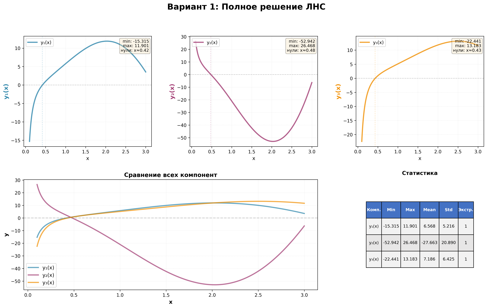

# Решение ЛНС (линейных неоднородных систем)

Решение дифференциальных уравнений вида **y' = Ay + q(x)** методом вариации постоянных.

## Зависимости

```bash
pip install -r requirements.txt
```

## Запуск

```bash
python main.py          # Готовый пример 1
python main.py 2        # Готовый пример 2
python main.py --custom # Своя система
```

## Custom режим

Для решения собственной системы необходимо ввести:
1. **Матрицу A**
2. **Фундаментальную матрицу Φ(x)** — удовлетворяет Φ'(x) = A·Φ(x)
3. **Неоднородность q(x)** — например: `x**2`, `exp(-2*x)`, `sin(x)` и т.д.

После решения доступна визуализация:
- **Графики решения** — поведение компонентов решения с анализом
- **Численный анализ** — погрешности, сходимость

Программа:
- Проверяет корректность Φ(x)
- Решает методом вариации постоянных
- Выводит общее решение **y(x) = Φ(x)·c + ψ(x)**

---

## Визуализация

Программа автоматически создаёт подробную аналитическую визуализацию решений:



- **Верхний ряд**: 3 графика компонент y₁(x), y₂(x), y₃(x) с метриками (min, max, нули)
- **Нижний левый**: Сводный график всех компонент для сравнения
- **Нижний правый**: Таблица со статистическим анализом

Для каждого решения сохраняются 3 файла:
- **PNG** - график
- **CSV** - численные данные для анализа
- **TXT** - подробный текстовый отчёт

## Результаты

Все результаты сохраняются в папку `results/`:
- **PNG** — графики с анализом
- **CSV** — численные данные для дальнейшего анализа
- **TXT** — подробный текстовый отчёт с анализом поведения функций

---

## Математика

Метод вариации постоянных для **y' = Ay + q(x)**:

1. Фундаментальная матрица **Φ(x)**: Φ'(x) = A·Φ(x)
2. **c'(x) = Φ⁻¹(x)·q(x)**, **c(x) = ∫c'(x)dx**
3. Частное решение **ψ(x) = Φ(x)·c(x)**
4. Общее решение **y(x) = Φ(x)·c + ψ(x)**
